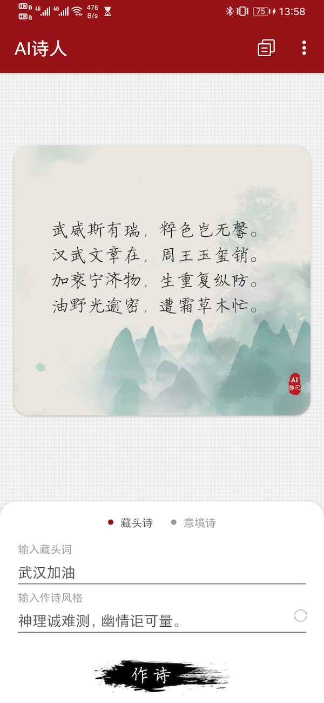
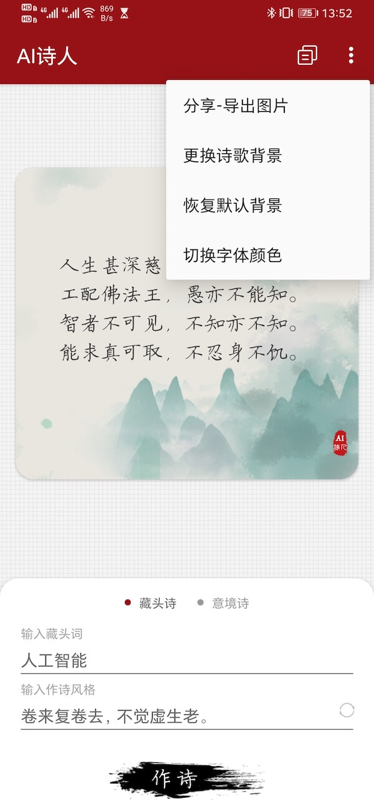
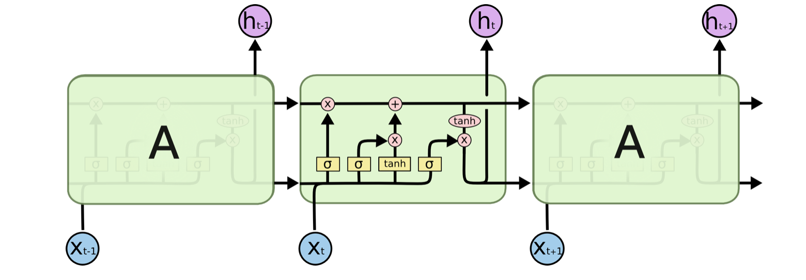
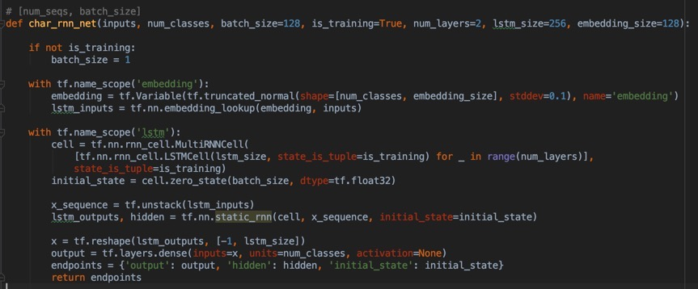

 
  
  <h2 align=center>Ai诗人</h2>

 

基于人工智能的 Android 写诗应用，无须联网随时随地写藏头诗、意境诗。使用长短时循环神经网络，针对五万多首唐诗进行训练，并且将训练模型移植到 Android 客户端中，当然你也可以将训练出的模型移植到任意平台。 

***如果你对此也感兴趣的话帮忙点个 star！***

***《理解循环网络及其在移动端的趣味应用：AI诗人》：*** https://pqpo.me/2020/02/11/learn-lstm-aipoet/

## 应用截图

 
  
  

  

## Ai作诗

安装包下载 -> [Release](https://github.com/pqpo/AIPoet/releases)

|导出文本|导出图片|
|:---:|:---:|
|人生不及此，曩年如故林。 工艺各不遂，道心固其深。 智者不可保，所以慰所任。 能为东都儿，不解令所箴。 ||

## 训练环境

- 本地环境  
  Python 版本：3.7.2  
  TensorFlow 版本：1.13.2  
  
- 训练环境  
  Google 免费提供的平台：Colaboratory  

## 训练模型

感谢训练集诗歌来源 -> [chinese-poetry](https://github.com/chinese-poetry/chinese-poetry)  

- 下载诗歌至目录：poetry-gen/data/raw-data/
- 诗歌数据转简体中文，运行脚本 poetry-gen/raw_data_2_simplified.sh
- 数据预处理，直接使用预处理好的二进制文件：poetry-gen/tang.npz 或 运行脚本 data_utils.py 自己生成
- 开始训练，运行脚本 poetry-gen/train.py
- 模型效果验证，运行脚本 poetry-gen/sample.py
- 训练结束后导出模型，运行脚本 poetry-gen/freeze_model.py
- 导出文字转换文件，运行脚本 poetry-gen/export_convert.py
- Android 项目工程 assets 目录下替换上述生成的 转换文件 与 模型文件

本次训练使用了 chinese-poetry 提供的唐诗集，总计5w多首唐诗，训练了 13w+ 次：

step: 134997/134997  loss: 1.5622  accuracy: 0.71  0.1806 sec/batch

## 神经网络

使用 TensorFlow 实现的 LSTM 网络：  
 

## About Me：

- Email：    pqponet@gmail.com
- GitHub：  [pqpo](https://github.com/pqpo)
- Blog：    [pqpo's notes](https://pqpo.me)
- Twitter: [Pqponet](https://twitter.com/Pqponet)
- WeChat: pqpo_me

## License

    Copyright 2017 pqpo
    
    Licensed under the Apache License, Version 2.0 (the "License");
    you may not use this file except in compliance with the License.
    You may obtain a copy of the License at
    
       http://www.apache.org/licenses/LICENSE-2.0
    
    Unless required by applicable law or agreed to in writing, software
    distributed under the License is distributed on an "AS IS" BASIS,
    WITHOUT WARRANTIES OR CONDITIONS OF ANY KIND, either express or implied.
    See the License for the specific language governing permissions and
    limitations under the License.

